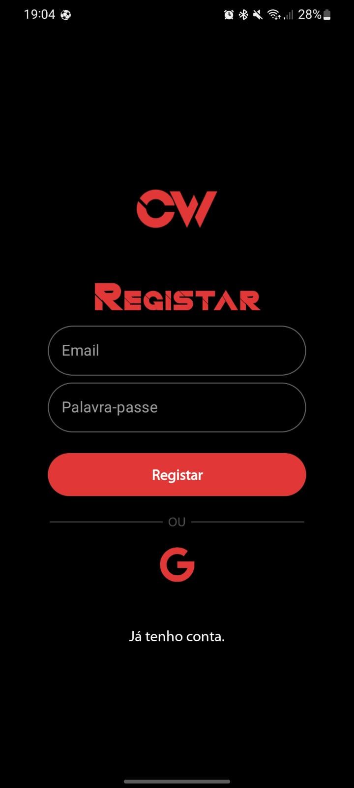
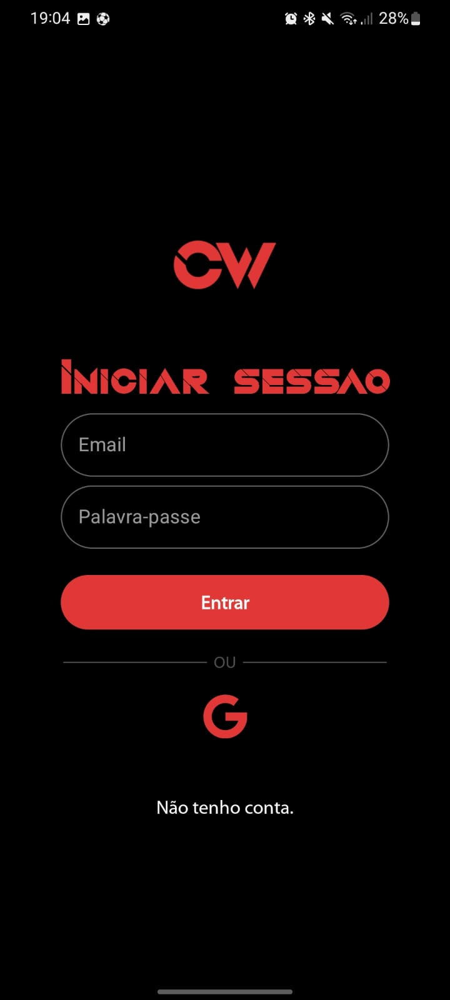
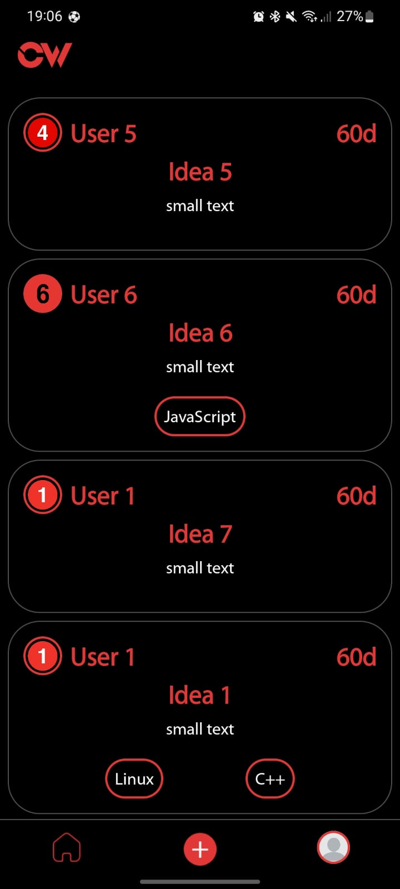
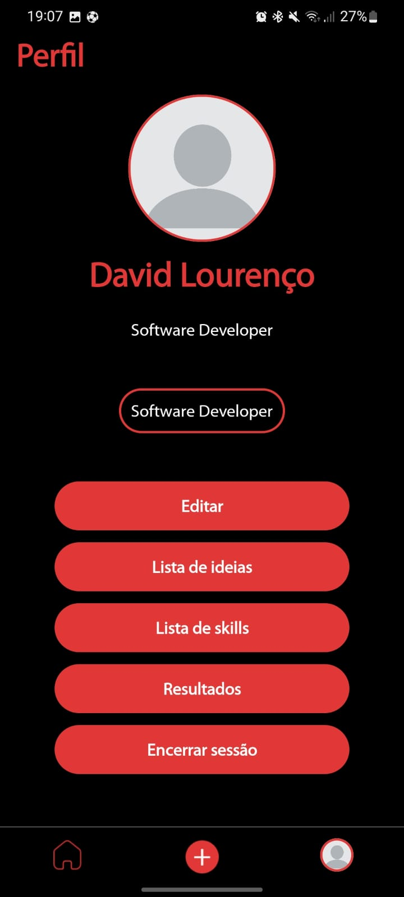

# CrossWorking

Project for PS course of the 2122 summer Semester, developed by:

* Lourenço Vala - https://github.com/lourencovala
* David Lourenço - https://github.com/dashwoodboy

Oriented by João Trindade

## Project organization

All code can be found in the [code](code) folder. Divided into 2 projects:

* [android](code/android/) - Android Studio project for android app.
* [server](code/server/) - IntelliJ IDE project for Web API.

Documents for the project can be found in the [docs](docs) folder.

 

 